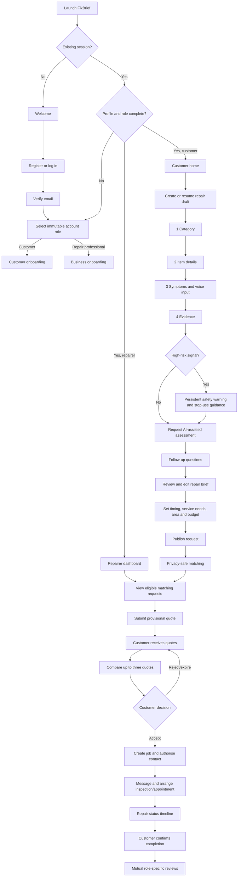
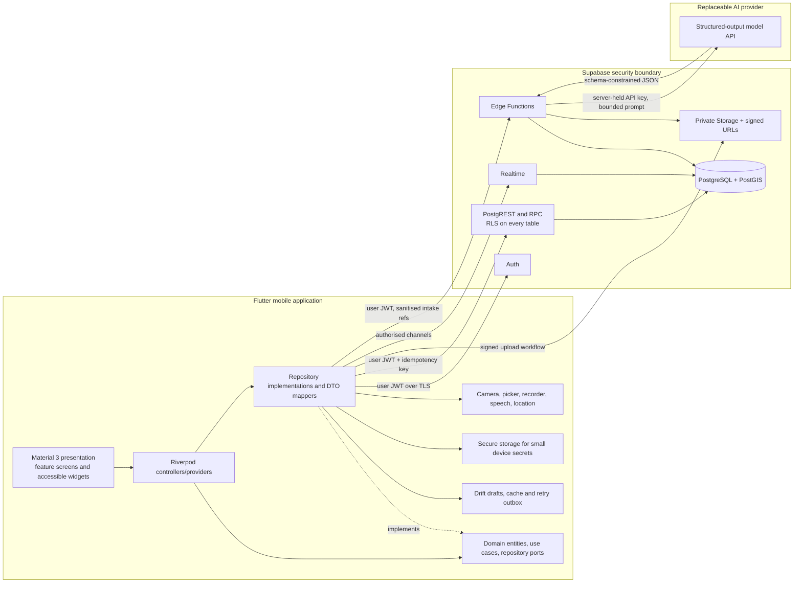
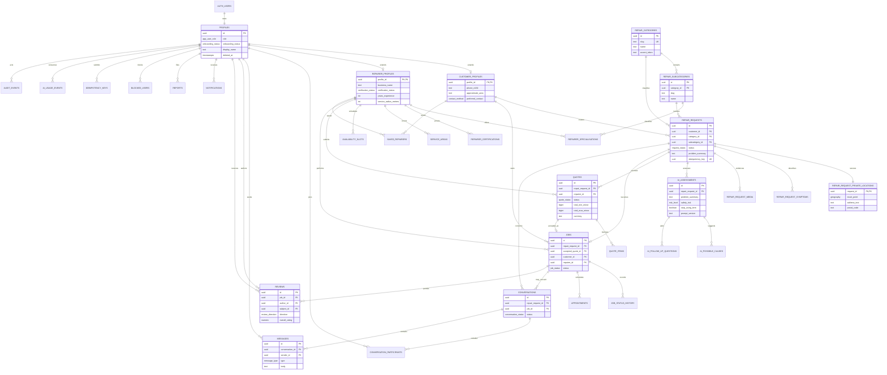
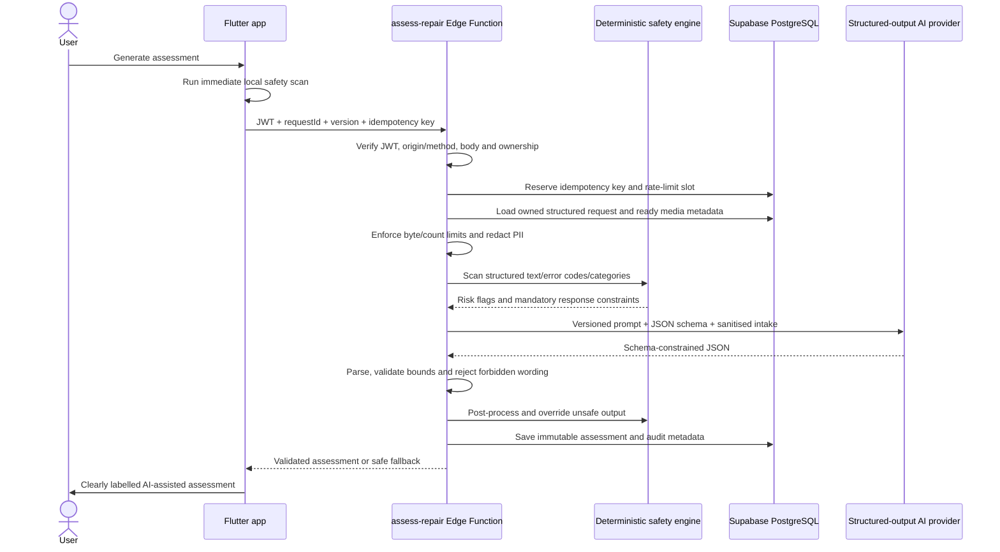

# FixBrief — Stage 1: architecture and setup

Status: complete  
Scope: architecture and a minimal runnable shell only  
Platforms: Android and iOS  
Backend: Supabase  
Client: Flutter, Dart, Material 3, Riverpod, GoRouter

## 1. Product summary

FixBrief is a two-sided repair marketplace. Customers describe a fault in
ordinary language and may add photos, videos, speech-to-text, audio, warning
lights, error codes, sensory observations, and repair history. A secure backend
organises that evidence into a structured **AI-assisted fault assessment** and
repair brief. Relevant repair professionals can view privacy-safe published
requests, submit provisional quotes, arrange inspections, message authorised
customers, and track accepted work through completion and review.

The product never presents AI output as a confirmed diagnosis. Every result
surface will carry the exact label:

> **AI-assisted assessment — not a confirmed diagnosis.**

Possible causes use cautious language, the deterministic safety engine may
override AI output, and physical inspection remains the authority.

## 2. Architectural principles

- Feature-first clean architecture: presentation depends on domain; data
  implements domain ports; domain does not import Flutter or Supabase.
- Riverpod owns dependency injection, async state, lifecycle, and test
  overrides. UI widgets do not construct repositories.
- Interfaces isolate Supabase, AI, storage, location, speech, media, and local
  persistence so providers can be replaced.
- Supabase PostgreSQL is the source of truth. Drift stores drafts, an idempotent
  retry outbox, and non-sensitive cached projections for limited offline use.
- Supabase Row-Level Security (RLS) is the primary authorisation boundary.
  Hiding a control in Flutter is never treated as authorisation.
- Precise customer location and private evidence are isolated from marketplace
  projections. Repairers initially receive only an approximate area.
- AI providers are reachable only from a Supabase Edge Function. No provider
  key, service-role key, prompt, or privileged logic ships in the app.
- Safety is defence in depth: immediate client rules, authoritative server
  rules, constrained AI prompts, JSON validation, and strong warning UI.
- Write operations carry a client-generated idempotency key. Connectivity state
  is a hint; every network operation still handles timeout and failure.
- Accessibility and graceful effect reduction are design-system invariants, not
  per-screen optional work.

## 3. User flow



## 4. System architecture



### Layer responsibilities

| Layer | Owns | Must not own |
|---|---|---|
| Presentation | Widgets, navigation intents, semantic labels, view state | SQL, Supabase calls, AI prompts |
| Application | Riverpod controllers, use-case orchestration, optimistic state | Provider-specific DTOs |
| Domain | Entities, value objects, repository interfaces, policies | Flutter, JSON transport, Supabase imports |
| Data | DTOs, mappers, Supabase/Dio/Drift adapters, repository implementations | Business policy hidden from domain |
| Backend | RLS, transactional invariants, matching RPCs, storage access, AI gateway | Trust in client-provided role or totals |

Feature-to-feature calls go through a small public domain API, not another
feature's data implementation. Shared code moves to `core/` only after it has at
least two real consumers and no feature-specific language.

## 5. Planned repository structure

The checked-in Stage 1 shell contains only files needed now. Empty future
directories are documented rather than padded with placeholder files.

```text
RepairQuote/
├── analysis_options.yaml
├── build.yaml
├── pubspec.yaml
├── config/
│   └── env.example.json
├── docs/
│   └── stage-1-architecture.md
├── lib/
│   ├── main.dart
│   ├── app/
│   │   ├── app.dart
│   │   └── bootstrap.dart
│   ├── core/
│   │   ├── config/
│   │   │   └── app_environment.dart
│   │   ├── constants/
│   │   │   └── user_role.dart
│   │   ├── errors/
│   │   ├── extensions/
│   │   ├── network/
│   │   ├── routing/
│   │   │   └── app_router.dart
│   │   ├── services/
│   │   ├── storage/
│   │   ├── theme/
│   │   ├── utils/
│   │   ├── validation/
│   │   └── widgets/
│   └── features/
│       ├── authentication/{data,domain,presentation}/
│       ├── onboarding/{data,domain,presentation}/
│       ├── customer_home/{data,domain,presentation}/
│       ├── repairer_dashboard/{data,domain,presentation}/
│       ├── repair_requests/{data,domain,presentation}/
│       ├── ai_assessment/{data,domain,presentation}/
│       ├── marketplace/{data,domain,presentation}/
│       ├── quotes/{data,domain,presentation}/
│       ├── messaging/{data,domain,presentation}/
│       ├── appointments/{data,domain,presentation}/
│       ├── jobs/{data,domain,presentation}/
│       ├── reviews/{data,domain,presentation}/
│       ├── notifications/{data,domain,presentation}/
│       ├── profile/{data,domain,presentation}/
│       └── settings/{data,domain,presentation}/
├── test/
│   ├── app_smoke_test.dart
│   ├── core/
│   ├── features/
│   └── helpers/
├── integration_test/
└── supabase/
    ├── config.toml
    ├── migrations/
    ├── seed.sql
    ├── tests/database/
    └── functions/
        ├── _shared/
        │   ├── auth.ts
        │   ├── cors.ts
        │   ├── errors.ts
        │   ├── pii_redactor.ts
        │   ├── rate_limit.ts
        │   └── safety/
        └── assess-repair/
            ├── index.ts
            ├── prompt.ts
            ├── schema.ts
            └── provider.ts
```

Inside each feature:

```text
feature/
├── data/
│   ├── datasources/
│   ├── dto/
│   ├── mappers/
│   └── repositories/
├── domain/
│   ├── entities/
│   ├── repositories/
│   ├── services/
│   └── use_cases/
└── presentation/
    ├── controllers/
    ├── providers/
    ├── screens/
    └── widgets/
```

## 6. Dependency plan

Package constraints were checked against official pub.dev listings on 16 July
2026. `pubspec.lock` should be committed for the application after the first
successful `flutter pub get` so CI and releases resolve identically.

### Runtime packages

| Package | Responsibility |
|---|---|
| `flutter`, `flutter_localizations`, `cupertino_icons` | Cross-platform UI, localisation foundation, fallback icons |
| `flutter_riverpod`, `riverpod_annotation` | State, dependency injection, generated providers |
| `go_router` | Declarative routing, deep links, role shells and redirects |
| `supabase_flutter` | Auth, PostgREST, Storage, Realtime and Edge Functions |
| `dio` | Replaceable external/Edge HTTP adapter, cancellation, retries, progress |
| `freezed_annotation`, `json_annotation` | Immutable model and JSON contracts |
| `flutter_secure_storage` | Small sensitive device values; never general caching |
| `drift`, `drift_flutter` | Typed offline drafts, cache and idempotent operation outbox |
| `image_picker`, `file_picker` | Photo/video capture and document selection |
| `record`, `speech_to_text` | Audio evidence and short-form voice input |
| `permission_handler` | Explicit permission state and settings recovery |
| `geolocator`, `geocoding` | Location and human-readable area lookup |
| `cached_network_image` | Signed media rendering and cache lifecycle |
| `connectivity_plus` | Connectivity hints; not proof of Internet reachability |
| `intl`, `flutter_localizations` | Dates, time, currency and future translations |
| `flutter_animate` | Maintainable motion with reduced-motion gating |
| `path_provider`, `path` | Temporary recordings, compression and local DB paths |
| `mime` | Extension plus magic-byte MIME checks |
| `crypto` | Content hashes/idempotent media fingerprints, not password storage |
| `uuid` | UUIDv4/v7 client operation identifiers |
| `collection` | Typed collection comparisons and utilities |

### Development packages

| Package | Responsibility |
|---|---|
| `flutter_test`, `integration_test` | Widget, unit and on-device flows |
| `flutter_lints`, `riverpod_lint` | Static quality and Riverpod correctness |
| `build_runner` | Unified code-generation runner |
| `freezed`, `json_serializable`, `riverpod_generator`, `drift_dev` | Model, provider and local DB generation |
| `mocktail` | Handwritten test doubles without mock generation |

The complete executable package declaration is the root `pubspec.yaml`.

## 7. Environment contract

### Flutter client defines

Only client-safe values are compiled into the mobile application:

| Name | Required | Example | Notes |
|---|---:|---|---|
| `APP_ENV` | yes | `development` | `development`, `staging`, or `production` |
| `SUPABASE_URL` | yes | `https://abc.supabase.co` | HTTPS except local development |
| `SUPABASE_ANON_KEY` | yes | `sb_publishable_...` | Supabase anon/publishable client key; RLS still required |

Create ignored `config/env.dev.json`, `config/env.staging.json`, and
`config/env.production.json` files from `config/env.example.json`. CI should
materialise each file from its secret store and delete it after the build.

The following values are forbidden in Flutter defines, source, assets, native
resource files, logs, or crash reports:

- AI provider API keys
- `SUPABASE_SERVICE_ROLE_KEY`
- database passwords
- signing passwords/private keys
- notification provider server credentials

### Edge Function secrets

Set with `supabase secrets set` per project:

| Name | Required | Purpose |
|---|---:|---|
| `AI_PROVIDER` | yes | Adapter selection, for example `openai` |
| `AI_API_KEY` | yes | Server-only provider credential |
| `AI_MODEL` | yes | Allowlisted structured-output model |
| `AI_TIMEOUT_MS` | yes | Hard upstream deadline, initially `20000` |
| `AI_MAX_INPUT_BYTES` | yes | Sanitised request limit, initially `200000` |
| `AI_RATE_LIMIT_PER_HOUR` | yes | Per-user assessment limit, initially `10` |
| `AI_PROMPT_VERSION` | yes | Persisted prompt/safety audit version |
| `LOG_LEVEL` | no | Metadata-only server logging threshold |

Supabase supplies function runtime values such as `SUPABASE_URL`, anon key, and
service-role key. The service-role key is used only in tightly scoped server
code after user JWT validation; it never substitutes for authenticating the
caller.

## 8. Role and identity model

The public product exposes exactly two account roles:

```dart
enum UserRole { customer, repairer }
```

`auth.users` owns identity; `public.profiles` owns the application role. A new
auth user receives a profile with no role. The authenticated user then invokes
the controlled `claim-role` function exactly once. The database function locks
the profile row, accepts only `customer` or `repairer`, rejects an existing role,
creates the corresponding subtype row, and writes an audit event. Direct client
updates to `profiles.role` are denied by column grants, RLS, and a trigger.

This avoids trusting editable auth metadata. A later role change requires a
reviewed backend process, never a Flutter update. Internal moderation/admin
authority uses a separate server-controlled JWT claim and is not an app role.

Onboarding states are `not_started`, `in_progress`, `submitted`, `approved`, and
`rejected`. Customer onboarding becomes complete after required contact and
area fields are present. Repairer onboarding can be submitted but marketplace
verification remains separate (`unverified`, `pending`, `verified`, `rejected`,
`suspended`). Verification is never self-assignable.

## 9. Navigation map and guards

GoRouter will use a root navigator for full-screen flows and two role-specific
`StatefulShellRoute.indexedStack` shells so tab history is retained. Route names
are stable deep-link identifiers; paths are implementation details.

### Shared/public routes

| Route name | Path | Guard |
|---|---|---|
| `splash` | `/` | bootstrap state |
| `welcome` | `/welcome` | signed out |
| `login` | `/auth/login` | signed out |
| `register` | `/auth/register` | signed out |
| `forgotPassword` | `/auth/forgot-password` | signed out |
| `emailVerification` | `/auth/verify-email` | authenticated or pending verification |
| `roleSelection` | `/onboarding/role` | authenticated, verified, role is null |
| `customerOnboarding` | `/onboarding/customer` | customer |
| `repairerOnboarding` | `/onboarding/repairer` | repairer |
| `notifications` | `/notifications` | authenticated |
| `settings` | `/settings` | authenticated |
| `helpSupport` | `/support` | any |
| `privacy` | `/legal/privacy` | any |
| `terms` | `/legal/terms` | any |
| `reportUser` | `/reports/new/:userId` | authenticated, relationship required |
| `blockedUsers` | `/settings/blocked-users` | authenticated |

### Customer shell

Floating destinations are Home, Requests, Messages, and Profile.

| Route group | Paths |
|---|---|
| Home | `/customer/home`, `/customer/history`, `/customer/saved-repairers` |
| Request wizard | `/customer/requests/new/category`, `/item`, `/symptoms`, `/evidence`, `/assessment`, `/follow-up`, `/review`, `/publish`, `/confirmation` |
| Requests | `/customer/requests`, `/customer/requests/:requestId` |
| Quotes | `/customer/requests/:requestId/quotes`, `/compare`, `/quotes/:quoteId` |
| Marketplace profile | `/customer/repairers/:repairerId` |
| Messaging | `/customer/messages`, `/customer/messages/:conversationId` |
| Appointment/job | `/customer/jobs/:jobId/appointment`, `/customer/jobs/:jobId`, `/customer/jobs/:jobId/review` |
| Profile | `/customer/profile`, `/settings` |

### Repairer shell

Floating destinations are Dashboard, Requests, Jobs, Messages, and Profile.

| Route group | Paths |
|---|---|
| Dashboard | `/repairer/dashboard`, `/repairer/earnings`, `/repairer/reviews` |
| Matching requests | `/repairer/requests`, `/repairer/requests/filters`, `/repairer/requests/:requestId` |
| Quotes | `/repairer/quotes`, `/repairer/requests/:requestId/quote`, `/repairer/quotes/:quoteId/edit` |
| Jobs | `/repairer/jobs`, `/repairer/jobs/:jobId`, `/repairer/jobs/:jobId/status`, `/repairer/jobs/:jobId/appointments` |
| Messaging | `/repairer/messages`, `/repairer/messages/:conversationId` |
| Business profile | `/repairer/profile`, `/repairer/profile/edit`, `/availability`, `/service-area` |

### Redirect order

1. Wait for local bootstrap and auth restoration on Splash.
2. Signed-out users may access public/legal/auth routes; other destinations
   redirect to Login with a validated internal `returnTo` path.
3. Unverified users redirect to Email Verification.
4. Users with no role redirect to Role Selection.
5. Users with incomplete onboarding redirect to their role's onboarding.
6. A customer attempting a repairer route (or reverse) goes to their own shell
   home; the backend still enforces access independently.
7. Deep-linked entity screens load by opaque UUID and show a friendly not-found
   or no-access state. They never reveal whether an unauthorised row exists.

Router refresh listens to a single auth/onboarding state provider. Redirects do
not query repositories directly and avoid loops by comparing the current named
route with the required state route.

## 10. Database design

### Data conventions

- Primary keys are UUIDs generated in PostgreSQL, except deterministic join keys
  where a composite unique constraint is clearer.
- All timestamps are `timestamptz` in UTC. Mutable records have `created_at`,
  `updated_at`, and optional `deleted_at`.
- Money is stored as non-negative integer minor units plus ISO 4217 currency,
  never floating point.
- Coordinates use PostGIS `geography(Point, 4326)`. Exact coordinates/address
  live only in `repair_request_private_locations`; marketplace views expose an
  approximate locality and coarse distance band.
- User text is length constrained. Rendered text is treated as plain text unless
  processed through an allowlist sanitizer.
- Evidence rows store bucket/object paths, not permanent public URLs. Signed
  URLs are short-lived transport values and are never persisted.
- Soft-deleted records are excluded by policies and normal views. Security and
  financial audit records are retained according to the legal retention policy.
- Optimistic concurrency uses `updated_at` or an integer `version` on editable
  aggregates such as requests and quotes.

### Entity relationship diagram



### Core enums and lifecycle

| Enum | Planned values |
|---|---|
| `app_user_role` | `customer`, `repairer` |
| `request_status` | `draft`, `submitted`, `assessment_complete`, `published`, `under_review`, `quotes_received`, `quote_accepted`, `cancelled`, `archived` |
| `quote_status` | `draft`, `submitted`, `accepted`, `rejected`, `withdrawn`, `expired` |
| `job_status` | `inspection_requested`, `inspection_booked`, `repair_scheduled`, `repair_in_progress`, `waiting_for_parts`, `ready_for_collection`, `completed`, `cancelled`, `disputed` |
| `appointment_status` | `proposed`, `confirmed`, `declined`, `cancelled`, `completed`, `no_show` |
| `urgency` | `emergency`, `asap`, `within_24_hours`, `within_3_days`, `within_1_week`, `flexible` |
| `risk_level` | `none`, `low`, `moderate`, `high`, `critical` |
| `media_kind` | `image`, `video`, `audio`, `error_code`, `receipt`, `warranty`, `document` |
| `message_type` | `text`, `image`, `document`, `repair_evidence`, `appointment`, `quote`, `job_system` |

The product timeline combines request and job states in the UI, but the database
keeps them separate because a draft request is not yet a job. Acceptance occurs
in one transaction: lock quote/request, expire competing active quotes, create
job, mark request `quote_accepted`, authorise conversation/location access, and
append the initial job history event.

### Table overview

| Table | Purpose and important constraints |
|---|---|
| `profiles` | One-to-one with `auth.users`; immutable nullable-then-once role, display identity, avatar path, onboarding/account status. |
| `customer_profiles` | Customer contact preferences, notification settings and approximate home area. Phone stored normalised; private fields self-only. |
| `repairer_profiles` | Business identity, description, experience, fees, capabilities, radius, verification and marketplace metrics. Verification/metrics server-only. |
| `repair_categories` | Ordered seeded top-level categories with unique slug, icon token, accent token and active flag. Public read. |
| `repair_subcategories` | Seeded category children; unique `(category_id, slug)`. Public read. |
| `repairer_specialisations` | Repairer-to-subcategory join with optional experience years; unique pair. |
| `repairer_certifications` | Private certificate metadata/object path, issuer, expiry and server-controlled verification. Never marketplace-readable as raw evidence. |
| `service_areas` | Repairer coverage centre/radius or region polygon, service capabilities and active flag; PostGIS GiST index. |
| `availability_slots` | Repairer recurring/exception availability in a declared IANA timezone; overlap checks. |
| `repair_requests` | Customer-owned aggregate: category/item/vehicle fields, brief, timing, service needs, coarse area, budget, urgency, status and version. Drafts owner-only. |
| `repair_request_private_locations` | Exact point/address, one per request; readable only by customer and authorised accepted repairer/appointment path. Matching functions can use it without returning it. |
| `repair_request_symptoms` | Structured sensory/situation symptom entries with type, text, source and order; customer-owned through request. |
| `repair_request_media` | Private object metadata, kind, MIME, byte size, checksum, sort order, upload status and deletion state. Database row is created only through validated upload workflow. |
| `ai_assessments` | Immutable versioned assessment snapshot, structured JSON plus indexed summary/risk fields, input hash, model/prompt/safety versions and validation status. No provider chain-of-thought. |
| `ai_possible_causes` | Ordered cautious cause, bounded confidence `0..1`, reason and customer-hidden flag. Confidence is an intake heuristic only. |
| `ai_follow_up_questions` | Ordered question, essential flag, answer, answer source, skip state and timestamps. |
| `quotes` | One active submitted quote per `(request, repairer)`, fee/labour/parts/other ranges, server totals, currency, expiry, availability, warranty, assumptions/exclusions and status. |
| `quote_items` | Optional typed line items with min/max minor units and order. Server trigger recalculates quote totals. |
| `jobs` | Exactly one accepted job per request and quote, both parties, current status, agreed estimate snapshot, completion/cancellation/dispute fields. |
| `job_status_history` | Append-only transition, actor, reason and timestamp. Triggered by valid job status changes; no client update/delete. |
| `appointments` | Job/request inspection or repair proposals, proposer, start/end, timezone, address-release flag, status and response. |
| `conversations` | Request/job-scoped channel with state. Unique active customer/repairer/request relationship. |
| `conversation_participants` | Membership, role, joined/left, last-read timestamp, muted flag. Membership is server-created from an authorised relationship. |
| `messages` | Append-oriented messages, sender, safe body/type, attachment object path, related entity, client idempotency ID, edited/deleted timestamps. |
| `reviews` | Job-bound directional review with role-specific category ratings and overall score; unique `(job_id, author_id)`, completed-job trigger. |
| `notifications` | User-owned type, related entity, safe payload, deep-link route name, read timestamp, dedupe key and delivery timestamps. |
| `saved_repairers` | Customer-to-repairer trusted list, unique pair. |
| `reports` | Reporter, subject, related entity, allowlisted reason and bounded details; reporter can read own submission, moderators only otherwise. |
| `blocked_users` | Directed block relationship, unique `(blocker_id, blocked_id)`, no self-block. Enforced in messaging and matching helpers. |
| `idempotency_keys` | User, operation scope/key, request hash, resource/result and expiry; unique `(user_id, scope, key)`. Prevents duplicate retries. |
| `ai_usage_events` | Per-user rate-limit buckets, status, input size and latency; no raw customer text. Server-only writes. |
| `audit_events` | Append-only actor/action/entity/outcome metadata for sensitive transitions; no evidence bodies or secrets. Server-only access. |

### Required database functions, triggers, and indexes

Stage 4 migrations will implement and test:

- `set_updated_at()` before-update trigger on mutable tables.
- `handle_new_auth_user()` creates a roleless profile safely and idempotently.
- `claim_user_role(role)` locks and assigns a valid role exactly once.
- `prevent_role_and_verification_tampering()` protects privileged columns even
  if a future policy is accidentally broadened.
- `validate_request_transition()` and `validate_job_transition()` implement
  explicit transition maps; no arbitrary enum jump.
- `record_job_status_change()` appends status history in the same transaction.
- `recalculate_quote_totals()` derives totals from fee/range fields/items,
  validates `min <= max`, and never trusts client totals.
- `accept_quote(quote_id, idempotency_key)` performs atomic acceptance and job
  creation under row locks.
- `recalculate_repairer_rating()` derives aggregates after eligible review
  inserts/soft deletion; no user-writable averages.
- `enforce_review_eligibility()` checks completed job, participant direction,
  uniqueness, and rating ranges.
- `can_view_marketplace_request()`, `can_access_conversation()`,
  `can_access_private_location()`, and `can_access_storage_object()` centralise
  policy predicates using stable SQL functions.
- `get_matching_requests()` and `get_matching_repairers()` are privacy-safe RPCs
  with PostGIS radius filtering and no precise point in their return types.
- `authorise_contact()` is transactionally tied to quote/contact/inspection
  conditions; arbitrary conversation inserts are prohibited.

Indexes include every foreign key used in policy checks, partial indexes for
active/not-deleted rows, GiST indexes for geographic fields, `(status,
created_at)` feeds, `(recipient_id, read_at, created_at)` notifications,
`(conversation_id, created_at, id)` message pagination, active quote uniqueness,
and trigram/full-text search only on non-private marketplace fields.

## 11. Row-Level Security strategy

RLS is enabled and forced on every public table. The `anon` role reads only
active category seed data and explicitly public legal content. All other access
requires `authenticated`. Table grants expose only required operations/columns;
RLS then narrows rows. Views use `security_invoker = true` unless a narrowly
audited RPC intentionally runs as `security definer` with fixed `search_path`.

### Policy matrix

| Data | Customer | Repairer | Server-only behaviour |
|---|---|---|---|
| Own profile subtype | select/update own permitted columns | select/update own permitted columns | role, verification, metrics protected |
| Public repairer projection | select active public fields | select active public fields | raw phone/address/cert paths excluded |
| Draft request | owner CRUD while draft | no access | soft deletion and transition validation |
| Published request | owner select/update allowed fields | eligible repairers select privacy-safe view only | matching RPC evaluates exact location |
| Private request location | owner select/update before lock | accepted/authorised repairer only | inspection acceptance can authorise |
| Request evidence | owner manage | eligible repairer signed read when request allows evidence | object path access checked independently |
| AI assessment | request owner select | eligible published/assigned repairer select | Edge Function insert/update only |
| Quote | request owner select and reject/accept via RPC | own insert/select/update before acceptance, withdraw | totals/acceptance/expiry transactional |
| Job/history | participating customer select | assigned repairer select | controlled status RPCs append history |
| Conversation/message | participants only; blocked relation enforced | participants only; blocked relation enforced | membership derives from authorised relation |
| Review | completed-job participant insert/select | completed-job participant insert/select | eligibility and aggregates enforced by trigger |
| Notification | recipient select/update `read_at` | recipient select/update `read_at` | inserts generated by trusted triggers/functions |
| Saved repairer/block | owner CRUD | owner CRUD for blocks | message/matching helpers honour blocks |
| Report | reporter insert/select own | reporter insert/select own | moderation data private |

### Policy implementation rules

- Ownership uses `(select auth.uid())` and indexed UUID columns.
- Policies never trust a request payload's `customer_id`, `repairer_id`, role,
  total, rating, verified flag, or status. `WITH CHECK` binds ownership to the
  authenticated user and triggers guard immutable fields.
- Repairer eligibility checks active profile, verification policy (configurable
  for MVP), category/specialisation, service area, capability, block state, and
  published/non-deleted request status.
- Precise location is structurally absent from marketplace views. RLS alone is
  not used as field-level redaction.
- Storage policies repeat database relationship checks; possession of an object
  path does not grant access.
- Realtime publications include only tables whose RLS projections are safe.
- Soft-deleted rows fail normal `USING` predicates. Account deletion is a
  server-orchestrated process so history required for disputes is anonymised or
  retained lawfully instead of cascaded unpredictably.
- Automated SQL tests impersonate anonymous, unrelated customer, owner,
  unrelated repairer, eligible repairer, accepted repairer, and blocked user for
  every sensitive table.

## 12. Storage strategy

All buckets are private. Clients store object paths and request short-lived
signed URLs after database authorisation. Default signed URL life is 5 minutes
for evidence/certifications and 15 minutes for display avatars; clients refresh
on demand and do not log query strings.

| Bucket | Path pattern | Initial limit | Allowed types |
|---|---|---:|---|
| `profile-images` | `{userId}/avatar/{uuid}.{ext}` | 5 MB | JPEG, PNG, WebP |
| `business-logos` | `{repairerId}/logo/{uuid}.{ext}` | 5 MB | JPEG, PNG, WebP, SVG only after sanitisation |
| `repair-request-images` | `{userId}/{requestId}/{mediaId}.{ext}` | 12 MB | JPEG, PNG, WebP, HEIC if server-transcoded |
| `repair-request-videos` | `{userId}/{requestId}/{mediaId}.{ext}` | 100 MB | MP4, QuickTime with server verification |
| `repair-request-audio` | `{userId}/{requestId}/{mediaId}.{ext}` | 25 MB | M4A/AAC, MP3, WAV with duration cap |
| `message-attachments` | `{userId}/{conversationId}/{messageId}/{uuid}.{ext}` | 25 MB | approved image/document/audio types |
| `certifications` | `{repairerId}/{certificationId}/{uuid}.{ext}` | 15 MB | PDF, JPEG, PNG |
| `review-media` | `{userId}/{reviewId}/{uuid}.{ext}` | 10 MB | JPEG, PNG, WebP |

Upload workflow:

1. Client validates count, extension, MIME magic bytes, size, duration, and
   dimensions; compresses images/video without destroying useful fault detail.
2. Client creates a local media task with UUID, checksum and state.
3. An authenticated backend/RPC validates ownership and issues the canonical
   object path (or signed upload token where appropriate).
4. Client uploads with progress and cancellation. Retry reuses the media UUID
   and path, preventing duplicate rows/objects.
5. Backend verifies actual object metadata/content and marks media `ready`;
   invalid or abandoned objects are quarantined/deleted.
6. Readers obtain a signed URL only after database and storage policy checks.
7. User deletion immediately revokes normal access and schedules secure object
   deletion, subject to dispute/legal retention requirements.

The app will recover Android picker lost data, explain permissions before
requesting them, and never retain raw voice recordings longer than the stated
purpose. Production malware scanning/transcoding is an asynchronous server
step; files remain unavailable to other users until it succeeds.

## 13. AI backend strategy

### Port boundaries

Flutter domain defines `AiAssessmentRepository.assess(request)` and immutable
request/response entities. The data implementation calls a FixBrief Edge
Function through an `AiAssessmentRemoteDataSource`. It has no AI-provider SDK.
The Edge Function defines its own `AiProvider` interface, allowing the upstream
model provider to change without a mobile release.

### Authoritative assessment pipeline



The function receives a request ID rather than accepting the client as the
source of truth for owned data. It authenticates the bearer JWT, loads data
under the user's identity where possible, verifies request ownership/version,
and rejects unpublished/invalid state. It does not send names, phone numbers,
email, exact location, serial/registration numbers, EXIF, filenames, or message
content unless explicitly necessary and consented.

### Structured output and validation

The response contract contains:

- `problem_summary`
- `possible_fault_categories[]`
- `possible_causes[]` with `name`, `confidence` in `0..1`, and cautious `reason`
- `urgency`, `safety_risk`, and `stop_using_item`
- `recommended_professional` and `recommended_specialisations[]`
- `follow_up_questions[]`, `missing_information[]`, and
  `recommended_evidence[]`
- `inspection_recommendation`, `repair_brief`, and the exact disclaimer

The Edge Function validates JSON syntax, exact required keys, types, enum
membership, lengths, array counts, confidence bounds, disclaimer equality, and
forbidden certainty/safety phrases. Flutter parses the same contract with
Freezed/json_serializable checked conversion and treats any mismatch as an
invalid response. Neither side displays partial unvalidated AI content.

The prompt states that possible causes may include the returned suggestions,
the assessment is based on supplied information, a qualified professional
should inspect the item, and the exact fault cannot be confirmed without
physical inspection. It prohibits DIY/dangerous tests and statements such as
“definitely”, “certainly broken”, or “safe to continue using”. Provider
chain-of-thought is neither requested nor stored.

### Failure, retry, timeout, and fallback

- One 20-second upstream deadline and an overall function deadline leave time
  for a controlled response.
- Retry at most twice with capped exponential backoff plus jitter, and only for
  connect timeout, HTTP 408, 429 (honouring `Retry-After`), and 5xx.
- Authentication, ownership, validation, content-size, and safety-rule failures
  are never automatically retried.
- The shared idempotency key returns the existing assessment for the same input
  hash. A changed request version needs a new key/assessment version.
- Circuit-breaker metadata can short-circuit a failing provider to a safe
  fallback without creating a retry storm.
- Fallback is a structured, non-diagnostic summary of customer-provided facts,
  deterministic safety warnings, recommended professional category, and a
  request to try assessment later. It never invents possible causes.
- Logs contain request/assessment IDs, stage, error class, duration, byte counts
  and prompt version—never raw intake, media, exact location, tokens, or keys.

Rate limiting uses atomic database buckets by user and IP hash with a stricter
anonymous rejection (assessment requires auth), plus daily abuse thresholds and
maximum concurrent calls. Provider limits are a second boundary, not the only
one.

## 14. Independent safety strategy

AI output cannot lower a deterministic risk. The same versioned rule catalogue
is represented in client-readable data for immediate feedback and in the Edge
Function for authoritative enforcement. Server rules win when versions differ.

Initial high-risk categories:

| Category | Example signals | Mandatory behaviour |
|---|---|---|
| Gas leak | gas smell, hissing near gas appliance, gas alarm | Critical warning, stop use, avoid testing, contact qualified/emergency service as locally appropriate |
| Exposed electricity | exposed/live wire, sparking, shock | Critical warning, keep clear, stop use/isolate only if already safe, qualified electrician |
| Electrical burning/fire/smoke | burning insulation smell, smoke, flame | Critical warning, stop use, evacuate/contact emergency services when appropriate |
| Severe overheating | glowing, melting, extreme heat | High/critical stop-use warning; no touching/opening |
| Vehicle brakes/steering | brake loss, steering loss, severe pull | Critical: do not drive or road-test; recovery/qualified mechanic |
| Fuel/chemical leak | fuel pool/fumes, unknown chemical escape | Critical: avoid ignition/contact/testing; professional/emergency response |
| Structural damage | collapse, unstable wall/roof/furniture | Keep clear, do not load/test, qualified professional |
| Pressurised system | bulging tank, escaping high-pressure fluid/gas | Keep clear, do not open/bleed/test |
| Water near electricity | leak onto sockets/appliance/panel | Critical combined hazard; do not touch wet electrical equipment |
| Battery swelling | swollen/hot phone or laptop battery | Stop use/charging, do not puncture/compress, specialist disposal/repair |
| Dangerous machinery | guard failure, unexpected activation | Stop use, isolate only through normal safe control, qualified technician |
| Sharp/unstable component | shattered glass, falling or tensioned part | Keep clear and prevent access; no handling advice |

Rules operate on normalised customer text, selected symptoms, error-code flags,
category context, and explicit answers. They use phrase groups plus negation and
context handling to reduce obvious false positives. A match returns rule ID,
risk level, evidence fields, warning title/body, prohibited actions, and
professional/emergency routing. It never confirms a fault.

The UI safety warning is persistent, mostly opaque, high contrast, icon plus
text, screen-reader announced, keyboard reachable, and cannot be hidden behind
decorative glass. Colour is supplemental. Dismissing an acknowledgement does
not remove the warning from assessment/request details. Reduced transparency or
motion only makes it more solid/static.

## 15. Liquid Glass design-system plan (Stage 2 contract)

Stage 1 defines the token contract; Stage 2 will implement it. The identity is
original FixBrief—calm, technical and repair-focused—not an Apple clone.

### Token groups

| Group | Planned tokens |
|---|---|
| Colour | deep navy, cool blue, cyan, soft teal, white, neutral greys; semantic success/info/warning/danger; distinct light/dark mappings |
| Category accents | vehicles electric blue; plumbing aqua; electrical amber; appliances violet; computers cyan; bicycles green; property warm orange; industrial steel blue |
| Glass material | blur `16/20/24`, light opacity `0.55–0.72`, dark opacity `0.35–0.55`, border `0.18–0.32`, top highlight, controlled tint |
| Shape | radii `12/18/24/28/32`, continuous rounded geometry, capsule navigation/actions |
| Elevation | shadow blur `20–32`, low-opacity navy shadows, no heavy black drop shadows |
| Spacing | 4-point scale with minimum 44×44 iOS / 48×48 Material interactive targets |
| Typography | platform-legible Material 3 scale, dynamic text, tabular currency/time where helpful, no fixed-height clipping |
| Motion | feedback `100–160ms`, small `180–250ms`, card `250–400ms`, page `350–500ms`, interruptible spring curves |
| Effects | `full`, `reduced`, `minimal`; user override plus sensible runtime default |

Separate light and dark themes tune surfaces, borders, shadows, reflections,
backgrounds and contrast; dark mode is not an inversion. Serious warnings and
destructive dialogs use dedicated opaque semantic surfaces.

### Planned theme files

```text
lib/core/theme/
├── liquid_glass_theme.dart
├── liquid_glass_tokens.dart
├── liquid_glass_colors.dart
├── liquid_glass_typography.dart
├── motion_tokens.dart
├── app_theme_mode.dart
└── accessibility_effects_controller.dart
```

### Planned reusable components

```text
lib/core/widgets/liquid_glass/
├── liquid_glass_container.dart
├── liquid_glass_card.dart
├── liquid_glass_button.dart
├── liquid_glass_navigation_bar.dart
├── liquid_glass_app_bar.dart
├── liquid_glass_bottom_sheet.dart
├── liquid_glass_dialog.dart
├── liquid_glass_search_bar.dart
├── liquid_glass_text_field.dart
├── liquid_glass_chip.dart
├── liquid_glass_status_pill.dart
├── liquid_glass_progress_indicator.dart
└── fluid_background.dart
```

Glass rendering will put one clipped `BackdropFilter` around a meaningful
surface, avoid nested filters, use `RepaintBoundary`, pause off-screen decorative
animation, and provide an opaque fallback. Effects controller inputs include
MediaQuery reduced motion/accessibility data, user setting, platform brightness,
and a conservative capability default. Accessibility settings always override
device heuristics.

## 16. Supabase project setup

### Cloud project

1. Create separate Supabase projects for development, staging, and production.
   Do not reuse production data for development.
2. Record each Project URL and client-safe anon/publishable key in the matching
   ignored Flutter JSON file. Keep service-role/database credentials in the
   deployment secret store only.
3. In Authentication, enable email/password, require email confirmation, set
   Site URL/deep-link allowlists per environment, and configure branded SMTP
   before production. Disable open redirects.
4. Set token/session policy, password minimums, leaked-password protection where
   available, CAPTCHA/abuse protection, and email rate limits appropriate to the
   launch market.
5. Enable PostGIS in a dedicated extensions schema during Stage 4 migration.
6. Do not create public Storage buckets manually yet; Stage 4 migrations/setup
   will create the exact private buckets and policies listed above.
7. Enable Realtime only for the required notification, conversation, message,
   appointment and job-status tables after their RLS tests pass.
8. Configure custom domains, log drains, backups/PITR, and alerting before
   production. Confirm the selected region meets data residency needs.

### CLI and local development

Install Docker Desktop and the Supabase CLI, then from the repository root:

```powershell
supabase login
supabase init
supabase link --project-ref YOUR_DEVELOPMENT_PROJECT_REF
supabase start
supabase status
```

Do not run `supabase db push` against production from a developer workstation.
Migrations will be tested locally, applied to development/staging in CI, then
promoted through a reviewed production deployment.

Stage 4 will add:

```powershell
supabase db reset
supabase test db
supabase db lint --level warning
supabase migration up --local
```

Stage 6 Edge Function development will use:

```powershell
supabase functions serve assess-repair --env-file supabase/functions/.env.local
supabase secrets set --env-file supabase/functions/.env.production
supabase functions deploy assess-repair
```

JWT verification is also performed explicitly in the function because the
function must resolve the authenticated user and ownership before work begins.
Function-local `.env` files are ignored and never committed.

## 17. Exact Flutter creation, generation, run, and test commands

### Install prerequisites on this Windows workstation

Flutter and Dart are not currently on `PATH`. One reproducible installation is:

```powershell
New-Item -ItemType Directory -Force C:\src | Out-Null
git clone https://github.com/flutter/flutter.git --branch stable --depth 1 C:\src\flutter
$env:Path = "C:\src\flutter\bin;$env:Path"
flutter --version
flutter doctor -v
flutter doctor --android-licenses
```

Add `C:\src\flutter\bin` permanently to the user `Path` after verification.
Install Android Studio/SDK, an Android API 23+ device or emulator, Git, Java 17
or the version required by the resolved Flutter toolchain, and Docker Desktop
for local Supabase. iOS compilation, CocoaPods, simulator/device signing, and
App Store archives require macOS with a supported Xcode version.

The package constraints require Dart 3.12+ and Flutter 3.44+. Use a stable SDK
that satisfies both and keep CI pinned to the same Flutter release.

### Add Android/iOS host projects to this repository

From a clean working tree in the root:

```powershell
cd C:\Users\User\Desktop\RepairQuote
flutter create --project-name fixbrief --org com.fixbrief --platforms android,ios --no-pub .
git diff -- pubspec.yaml analysis_options.yaml lib README.md
```

Review the diff and retain the checked-in FixBrief versions of those files. The
command's purpose is to generate the standard `android/` and `ios/` hosts. Do
not repeatedly regenerate them after native permissions/signing work begins.

### Configure and install dependencies

```powershell
Copy-Item config\env.example.json config\env.dev.json
notepad config\env.dev.json
flutter clean
flutter pub get
flutter pub outdated
```

`flutter pub outdated` is informational; do not blindly upgrade a release
branch. Commit the generated `pubspec.lock` after dependency resolution and
review native minimum-version changes before any later upgrade.

### Generate source

```powershell
dart run build_runner build --delete-conflicting-outputs
```

During model/provider development:

```powershell
dart run build_runner watch --delete-conflicting-outputs
```

Generated `*.g.dart` and `*.freezed.dart` files are ignored in this Stage 1
repository and must be regenerated in CI before analysis/test/build. The team
may instead choose to commit generated sources later, but it must make one
consistent CI/review decision.

### Run

```powershell
flutter devices
flutter run -d YOUR_ANDROID_DEVICE_ID --dart-define-from-file=config/env.dev.json
```

On macOS for iOS:

```bash
flutter pub get
cd ios && pod install && cd ..
flutter run -d YOUR_IOS_DEVICE_ID --dart-define-from-file=config/env.dev.json
```

Release builds use environment-specific ignored files supplied by CI:

```powershell
flutter build appbundle --release --dart-define-from-file=config/env.production.json
```

```bash
flutter build ipa --release --dart-define-from-file=config/env.production.json
```

### Verify Stage 1

```powershell
dart format --output=none --set-exit-if-changed lib test
flutter analyze
flutter test --coverage
flutter run --dart-define-from-file=config/env.dev.json
```

Expected manual result: a responsive Material 3 FixBrief setup shell shows the
name, tagline, Stage 1 status, and current environment. This is intentionally
not the Liquid Glass prototype; that belongs to Stage 2.

## 18. Development and product risks

| Risk | Impact | Stage 1 decision/mitigation |
|---|---|---|
| AI appears authoritative | Unsafe reliance and liability | Exact disclaimer, cautious schema/prompt, deterministic safety override, physical-inspection language |
| AI emits invalid/unsafe JSON | Broken or harmful UI | Provider schema, strict server validator, forbidden phrase scan, checked Dart parsing, safe fallback |
| Sensitive evidence/addresses leak | Serious privacy harm | Private buckets, short signed URLs, separate exact-location table, privacy-safe views/RPCs, metadata-only logs |
| RLS recursion/performance defects | Data exposure or slow feeds | Indexed helper functions, fixed search path, security-invoker views, role matrix SQL tests, explain plans |
| Client role/status/quote tampering | Privilege or financial abuse | One-time server role claim, protected columns, calculated totals, transition RPCs/triggers |
| Duplicate publish/quote/job on reconnect | Confusing or financial inconsistency | UUID idempotency keys, request hashes, unique constraints, transactional RPCs, Drift outbox |
| Connectivity reports Wi-Fi without Internet | Lost work/retry loops | Always handle Dio/Supabase failures; connectivity is only a retry hint |
| Large media causes cost/performance issues | Failed uploads and high spend | Strict count/size/duration limits, compression, resumable strategy, checksums, async verification |
| Realtime leaks or scales poorly | Privacy/performance | Publish only tested tables, RLS on subscription, paginated history, scoped channels |
| Glass effects jank/low contrast | Unusable app on mid-range devices | Central full/reduced/minimal effects, limited blur, opaque accessibility fallback, performance budgets |
| Plugin/platform churn | Build failures | Stable constraints, committed lockfile, pinned CI Flutter, native upgrade review and device matrix |
| Geocoding quality/rate limits | Bad matching or location exposure | User-confirmed locality, provider abstraction, cached coarse area, exact matching server-side |
| Marketplace cold start | Few useful quotes | Broad categories, transparent response expectations, operational onboarding; validate supply market by market |
| Review/verification fraud | Loss of trust | Completed-job-only reviews, derived metrics, evidence verification workflow, moderation/report audit |
| Legal/privacy requirements vary | Launch delay or non-compliance | Placeholder legal screens clearly marked for counsel; retention, consent and emergency wording reviewed per market |

## 19. Manual Supabase work for this stage

Stage 1 requires only project/environment preparation. No production table,
bucket, RLS policy, or Edge Function should be created ad hoc in the dashboard;
those arrive as reviewed migrations in Stages 4 and 6.

Manual actions now:

1. Create development, staging, and production projects in suitable regions.
2. Configure email/password auth, verified redirect URLs, and development SMTP
   expectations.
3. Put development Project URL and anon/publishable key in the ignored
   `config/env.dev.json`.
4. Install/link the Supabase CLI and verify local Docker startup.
5. Establish team/CI secret stores for service role, database password, AI key,
   signing keys, and environment JSON materialisation.
6. Restrict dashboard/project membership and require MFA for privileged team
   members.

## 20. Known Stage 1 limitations

- Flutter/Dart are unavailable on this workstation's `PATH`, so dependency
  resolution, formatting, analysis, widget tests, and native builds could not be
  executed here. The source was reviewed statically and exact verification
  commands are above.
- Standard `android/` and `ios/` host directories are not checked in because
  they must be generated by the installed Flutter version, then configured for
  permissions/signing in their implementation stages.
- Supabase client initialisation intentionally begins in Stage 3; the Stage 1
  shell validates environment configuration but makes no backend calls.
- SQL migrations, RLS policies, private buckets and seed data are plans only
  until Stage 4, as required by the staged brief.
- Liquid Glass tokens/widgets and the three prototype screens are Stage 2.
- Authentication/onboarding, repair wizard, AI Edge Function, marketplace,
  quotes, realtime messaging, jobs, reviews, notifications and deployment are
  not implemented yet.
- Placeholder privacy/terms content will require qualified legal review before
  any public release.

## 21. Stage 1 file manifest

| File | Purpose |
|---|---|
| `.gitignore` | Protects local config/secrets and excludes reproducible build/generated artifacts. |
| `README.md` | Product/status summary and shortest bootstrap path. |
| `analysis_options.yaml` | Strict analysis and Riverpod custom-lint setup. |
| `build.yaml` | Checked, snake-case JSON generation defaults and coverage preamble. |
| `pubspec.yaml` | Complete planned Flutter runtime/development package set. |
| `config/env.example.json` | Non-secret client configuration contract. |
| `docs/stage-1-architecture.md` | Complete Stage 1 architecture, diagrams, security and setup plan. |
| `lib/main.dart` | Async application entry point. |
| `lib/app/bootstrap.dart` | Binding, environment validation and root ProviderScope. |
| `lib/app/app.dart` | Minimal Material 3 application shell; Stage 2 will replace visual theme. |
| `lib/core/config/app_environment.dart` | Typed compile-time flavour/Supabase client configuration validation. |
| `lib/core/constants/user_role.dart` | Two-role domain vocabulary and database conversion. |
| `lib/core/routing/app_router.dart` | Minimal Stage 1 GoRouter and setup screen; full guarded map is documented above. |
| `test/app_smoke_test.dart` | Widget smoke test for Stage 1 identity and shell. |

Stage 1 stops here. Stage 2 should not begin until the user says **continue**.
